# <u>MouseChat User Guide</u>
## By Jason Birdsong, Luke Cerminaro, Ryan Eagan, Luke Johnson, and Bryan Kohler

### <u>Web Navigation Outline</u>

### <u>MouseChat Homepage</u>
- Users are first taken to the homepage when they open MouseChat (`/`). From here, users can either login by clicking the login button or create an account on the platform by clicking the signup button. If users click on the login button, they will be redirected to our login page, from which they will be able to access the rest of the site once they are authenticated. If users click on the signup button, they will be redirected to our signup page to make an account. This page was created to make it easier for the user to access the rest of MouseChat without needing to know specific URLs

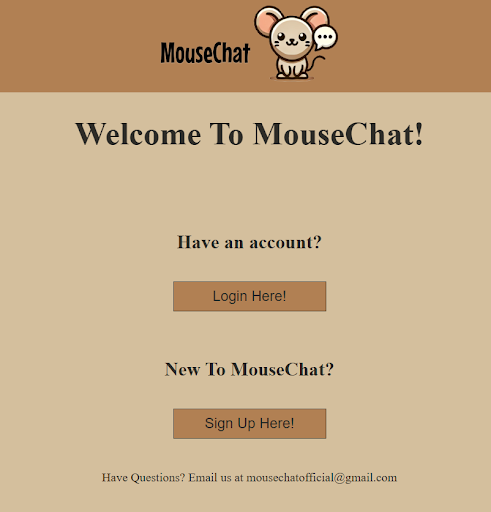

### <u> MouseChat SignUp </u>
- On the MouseChat sign up page, (`/signup`) the user is presented with the standard MouseChat header logo and the footer. The User sees a message prompting the user to sign up and four separate input fields in a column down the page ending in a button that prompts the user to sign up. The first field prompts for a username, the second prompts for a password, the third prompts for the all important favorite cheese, and the final prompt is for an image upload that will be used as the User’s profile picture. The profile picture selection allows you to upload a jpg/jpeg only as your user profile picture.  If all fields are filled in correctly, and the signup button is clicked, then a new user is created and redirected to the login page. If the username is already taken, an error occurs, the sign up page is reloaded and the user is prompted to input a different username. Upon a successful signup, the password is hashed using a hash function from the bcrypt module, and stored in the database with other user information.

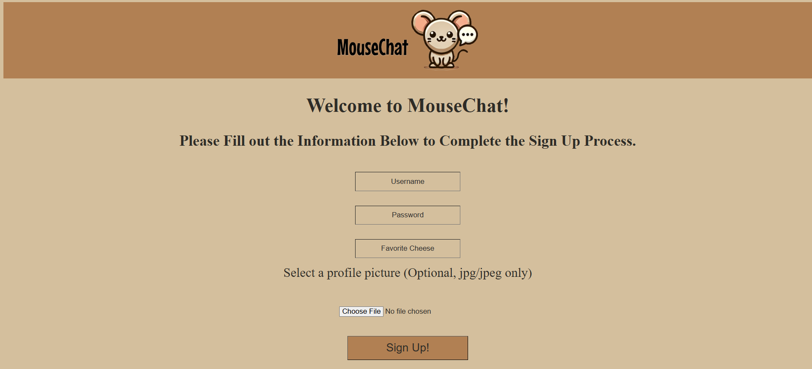

### <u> MouseChat Login </u>
- On the MouseChat login page, (`/login`) the user is presented with the standard MouseChat header logo and the footer.  They also see two text boxes and a button.  The first text box is the User ID box.  This text box is where the user would type in their existing username/User ID.  The second text box is the Password box.  This box is where the user would type in their existing password.  To login, the user would enter their existing and corresponding login information and click the “Log in” button. 

### <u> Themes (Visuals/CSS) </u>
- On every page, in the footer near the bottom, There is a section to choose a theme.  There are currently 7 themes for users to choose from in the form of radio buttons: Mouse, Rat, Cheese, Field, Space Mouse, Lab Rat, and Black Plague.  When a user clicks/selects one of the options, the color scheme of the site changes.  This change will persist through the site, even if the user closes out of the site and reopens it.
- Each page has a pug file associated with it, and each pug file references a CSS style sheet.  This style sheet is what makes the website look like it does.  In the style sheet, any color option is set to a variable, with the base value being the Mouse theme colors.  When a user selects a new theme, the color variables are set to the associated values.  There is also a javascript file that locally stores the last selected theme for the theme to be consistent throughout the site, and retrieves the saved theme when they enter a new page.
- The addition of themes and the overall look of the site was added for the benefit of the user.  The site looks colorful and fun, and the user is given multiple options of colors for the site.  It gives each user an extra bit of personalization. We used CSS stylesheets because that is the primary way websites improve the visuals for their sites nowadays.

### <u> Message Selector </u>
- The message selector page (`/message`) serves as the main page for users once they have successfully logged into the application. It includes many options for navigating to the rest of the features of the website. It displays a welcome message with the current user, including the profile picture (which will squeak upon being clicked, in keeping with the broader theme). Below are many buttons that show the chatting options. There are buttons to see who the user has already established communication with and to show the complete list of users in order to find more contacts. Following those buttons are forms for checking if a user is online, and entering a private message room (`/message/<sender>~<receiver>`). Users type in the user they want to check/communicate with and press the button in order to access the result of each respective function.  The next buttons handle group messaging, with one button taking the user to the group messaging page (`/message/chooseMousehole`) where they can specify the group they want to send messages to, and another button that takes users to a page where they can create a group (`/message/createMousehole`). Following the group message buttons, are buttons for accessing the global chat (`/message/horde/<username>`), changing user settings (`/settings`), and logging out of the website.

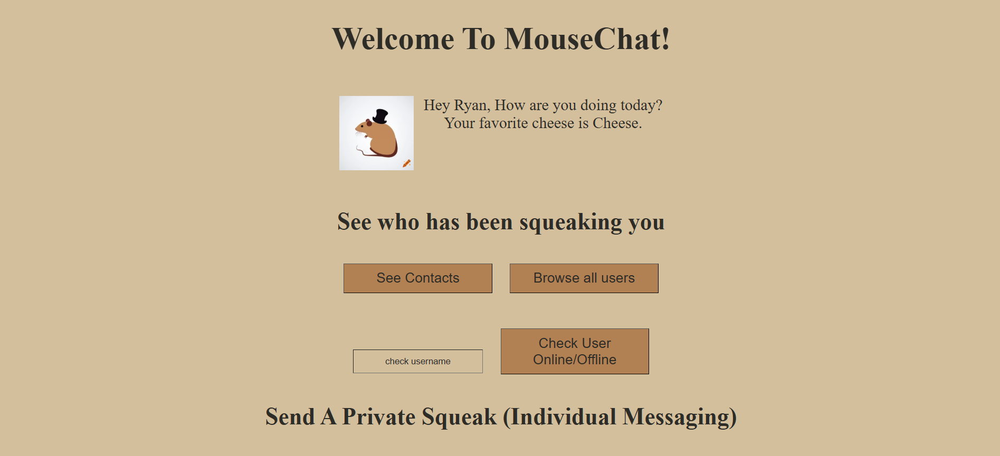

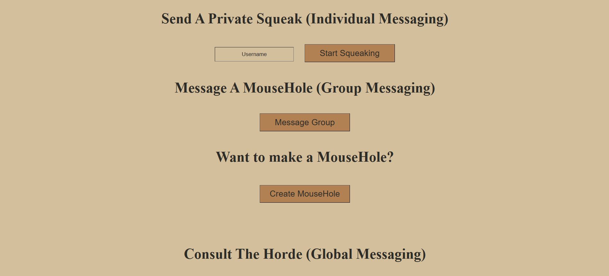

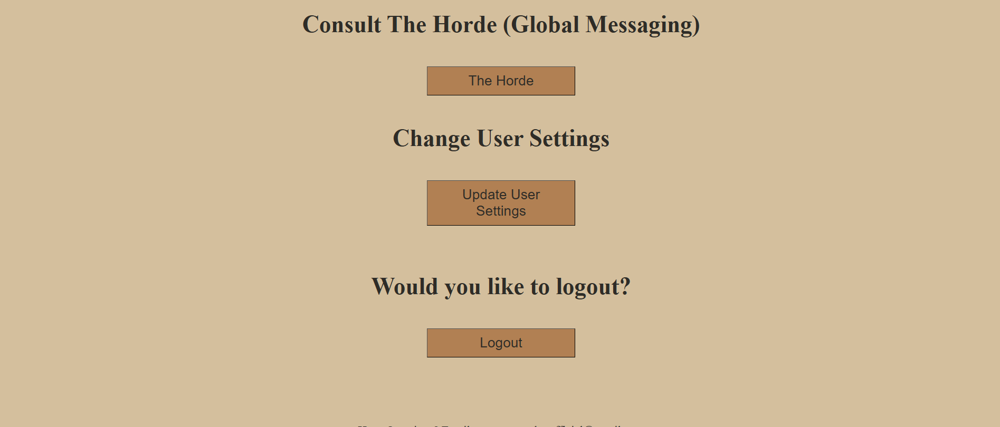

### <u> User Utility Functions (Contacts, All Users, is Online Checker) </u>

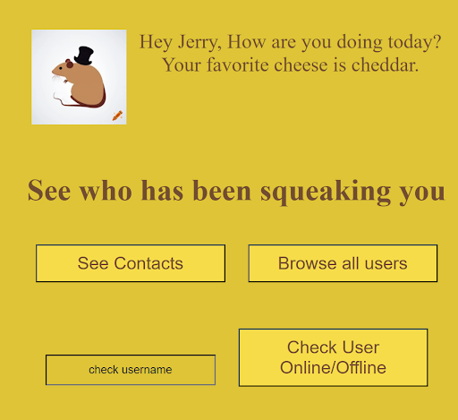

- All of these act as functionality to help users find other new users to message, check who they’ve messaged with before, and see if their friends are online. For their usefulness we decided to put them at the top of the /message page below only the welcoming quip and profile picture where users will find them easiest, and also decided to clump them together under one section.
- Contacts page (`/message/:uname/contacts`) is routed to upon clicking the button, this page loads the string array of all usernames of the users that have opened a private squeak with this logged in user. This is tracked by being added to both users contacts list when either of them first opens up a private squeak between the two. This allows a user being messaged by a new user to be able to find out that they have been messaged by them, and also helps anyone who forgets their friends’ 

- All users browser is a button that redirects to /all where all users’ usernames in the database are loaded and printed in alphabetical order in one convenient location. For a large application with many users this would be impractical compared to strong search algorithms, however for a smaller user base we decided it would be most convenient for there to be a page accessible to all users that allows everyone to scroll through and search for other users to message. The only other ways to find new users to squeak is to know what their name is from being told it outside of MouseChat, or by seeing them in The Horde. 

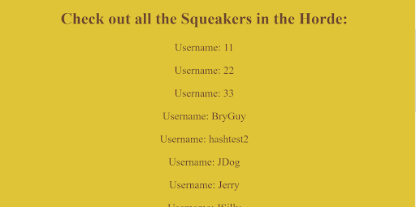

- The online user search functionality allows users to type in a username and upon clicking the button will reload the /message page with a message underneath the input box and button that displays the accurate information regarding the user’s activity. If the username does not match any existing username then the output will state `(user) does not exist`, if the database sees that the user is online it will say `(user) is online`, if the database sees the user is not connected it will display `(user) is offline`. The choice to reload the same page was due to how impractical it seemed to have a whole new page loaded for a single user’s online information to be loaded, instead being far more convenient to be able to check multiple users in quick succession. In this way it also means you will be right by all the messaging functionality when you go to message the user you checked, allowing you to look at the exact spelling you used.

<u> User Does Not Exist </u>

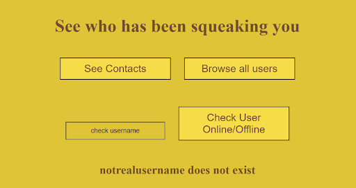

<u> User is Offline </u>

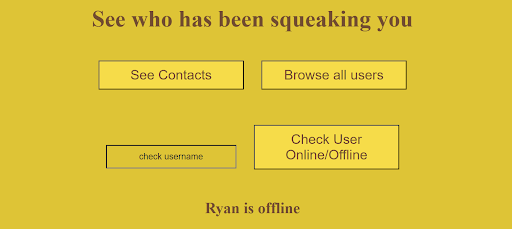

<u> User is Online </u>

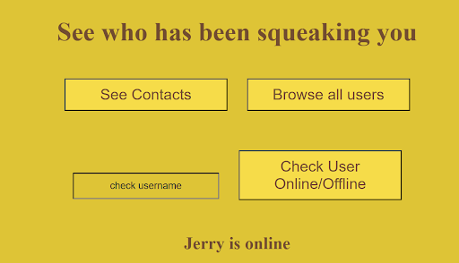

### <u> Private Squeaks (Individual Messaging) </u>
- Located directly below the section for user utilities on the `/message` page is the section for going to private individual messaging, aka private squeaks. It’s located at the top of the messaging types so that it can be located near the user utility section, as those utilities are most helpful for going to a private message. Additionally it then allowed us to organize the messaging in ascending order of broadness, which is also decreasing order of need for user utilities. When an invalid username is entered, i.e. one that does not belong to any existing user, routes the user back to the `/message` page, reloading it. This lets the user go right back into messaging while also acting as a way to notify the user that their input was indeed sent and processed.

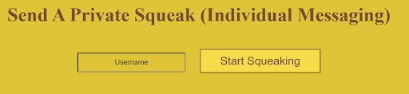

- Upon entering a valid username the user will be routed to `/message/:sndrcv`, where `:sndrcv` always takes the form of `(sender name)~(receiver name)` when it is constructed in the client side of the socket for that respective page. When entering this page the client emits a signal to make sure the receiver name exists, create a private squeak object in the database if it doesn’t exist already (creation of a Private Squeaks also appends both users to the other’s contacts list), updates the socket id of the sender’s database entry to their current socket, and loads any existing chat history. All of these actions are a sort of housekeeping that is done before the page is loaded so that the user can immediately send and see messages on loading. Tracking socket ids this centralized way is specifically convenient for single user to single user communication, allowing the server to easily pass along messages to their associated sockets. Additionally formatting the URL this way reminds users who they are logged in as and who they are messaging at that point. It also would allow users to pick up on the pattern and switch between different private chats directly by typing in a different username they know. This still redirects to `/message` on invalid name, and the logged in user must match the sender name in the url. Full functionality is there for switching between chats in this way.

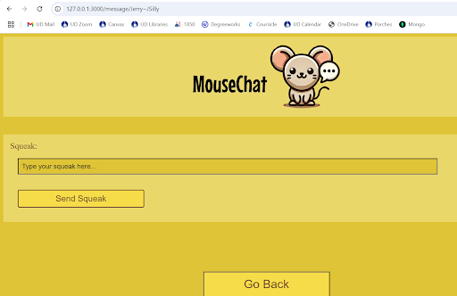

- The page that loads looks like this for a brand new private squeak. For one that has had messages sent and saved to its chat history it would be loaded on first entering in chronological order, with the button being in a fixed place and the squeaks being able to be scrolled through. This is for ease of sending messages, and relies on the reasonable assumption that a user would not need to see particularly many messages at any single time, instead letting them scroll through as they read. Upon sending a message the text is sent to the server and then sent back to the user to display it on the screen, although this fact is not known by the user, in the case something goes wrong it would make it easier to tell as the text box would become empty and no visual cue will be given that the message sent. If the receiver is logged in and on the same private squeak page they will also be sent the message in real time. No matter what, every message when reaching the server is also saved to the chat history of that specific private squeak in the database, which will then be loaded upon entering the squeak. This persistent storage allows users to never miss any message sent to them, granting great convenience in use of the app, cutting back on the need for others being online to talk to them.

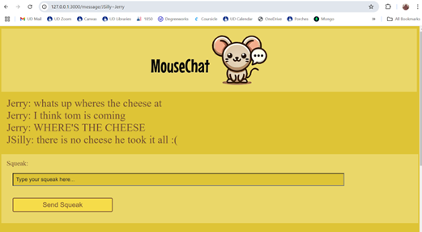

### <u> MouseHoles </u> 
- On the createMousehole page (`/message/createMousehole`), users are prompted to create a MouseHole. In order to make a MouseHole (groupchat), users need to enter a valid MouseHole name (no spaces or ~) and enter the usernames of the other users they want to make a groupchat with. If any of the users entered are not valid users, the user will be redirected back to their message selector, and the MouseHole will not be created. If all of the users and the MouseHole name are valid, the MouseHole will be created, and users are redirected back to their message selector page. Also, at any time users can return to the message selector page by hitting the back button.

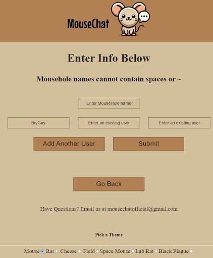

- On the MouseHole selector page (`/message/chooseMousehole`), users are shown a list of all of the MouseHoles that they are a part of, along with all of the other users in that MouseHole. Users can then type in the MouseHole name that they wish to chat in. If they type a MouseHole name that they are not a part of, the page will tell the user that they are not able to join that chat. Also, at any time users can return to the message selector page by hitting the back button. 

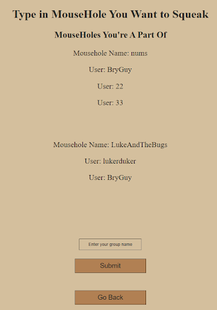

- On the MouseHole page (`/message/mousehole/<mouseholename>~<username>`), users can chat with all of the users in their MouseHole. The URL is custom for each user, where the first part after mousehole/ is the name of the MouseHole, and the second part after the “~” is the current user’s username. 

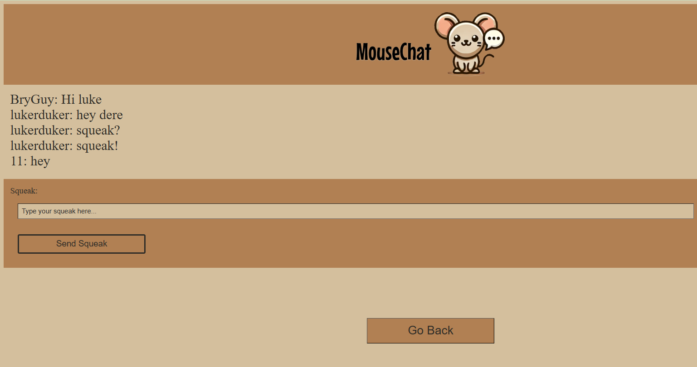

- Design Rationale:
    - We chose to exclude spaces and ~ from group chat names in order to make handling the MouseHole chat URLs easier, since we parse the URL to obtain the user’s username and the desired group chat and we specifically use ~ to delimit the two data fields.
    - To implement group chats, we decided to utilize the in-built functionality of rooms in socket.io, since you can broadcast a message to all sockets attached to a room without specifically knowing their socket id’s and messaging/updating every user in a group chat whenever you send a message. It is much easier and simpler to send a message to a room than to send every message from every sender to every receiver between each socket id individually.
    - We chose to have the createMousehole page separate from the chooseMousehole page just to keep each page simple and differentiable. 
    - We also decided to display a list of all group chats that your user is a part of so that when you attempt to join a group chat by typing in its name, you won’t have to constantly remember what the chat’s name is whenever you want to use it.

### <u> The Horde (Global Messaging) </u>

- From the Message Selector Page, the user can choose to be redirected to The Horde’s messaging page (`/message/horde/<username>`). From this page a user is able to send a message to every other user in the database without having to know their usernames at all. This page is split into four parts, at the top is the header that is on every page of Mouse Chat, below that is a scrollable window which shows all chat history as well as new chats as you send them, below that is the input box where a user can type in and send a squeak (message) globally, finally, at the bottom of the page is the footer that includes contact information as well as the ability to switch themes that can be seen on all other MouseChat pages.

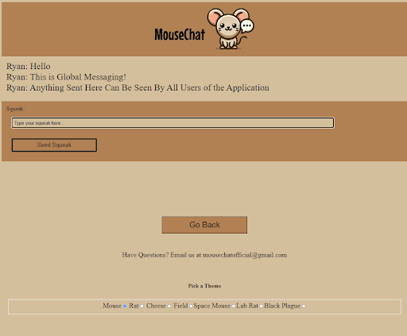

- The layout of the page was designed to make seeing old messages easy while still being able to send messages at any time. Having the chat history as its own scrollable section in the middle of the page allows for the message input box to still be on screen while a user is looking at old messages. In addition, whenever a user sends a message, the scrollable chat history automatically scrolls down to be able to see the new message, which again allows the user to be able to keep track of everything that is going on in the chat.

### <u> Settings Pages </u> 
- Towards the bottom of the `/message` page, after the Horde messaging section is a section with one button that says “Update Settings”. Upon clicking this the user is redirected to the `/settings` page which has a series of buttons that all redirect to their own respective pages to update a specific attribute. The various buttons are for updating: favorite cheese, username, profile picture, and password. As well as a button that redirects to a page for deleting your account. All of the updating buttons redirect to a respective page for that specific function, i.e. clicking the update cheese button redirects to `/updateUserCheese`. Each of these pages has only a single input textbox, a button to submit the update, and a button to go back to settings. When an update is submitted the user is redirected back to `/settings`, where the greetings quip at the top will make 3 out of 4 of the updates have a visual cue that the update went through. This is to make it easier for the user to be sure that the update worked. Password does not do this firstly because we do not store any unhashed passwords, and secondly because even if we did, displaying a password on screen would be a major security fault. The delete user button redirects to a page called `/deleteUser`, which prompts the user to input their username and password. When the submit button is clicked, if the username and password match up with those of the logged in user session, then the account is deleted and the user is redirected to the homepage. The reason each button redirects to its own page is one: much more convenient to code as each page can simply use its own `POST` route on its own URL and no wires between any of them would be crossed, and two: because it makes it more clear to the user what they are updating by putting in information. Specifically having 5 sections of different text boxes and buttons could easily get overwhelming and confusing, by having all of them be buttons the amount of things on one screen is much more reasonable and easier to navigate.

<u>Settings Link Button</u>

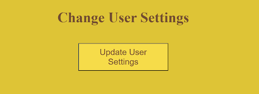

<u> Some Settings Page Options </u>

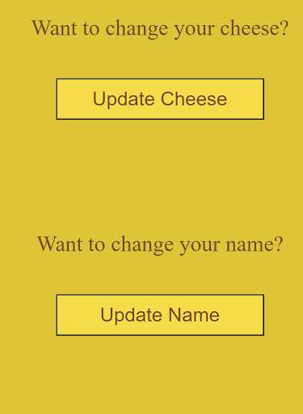

<u> Update Cheese Page </u>

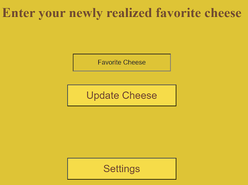

### <u> Heroku Deployment URL </u>
To access MouseChat from your browser go use the link below:

[MouseChat](https://mousechat-04752a8a3873.herokuapp.com/)

### <u> Trello Board Access </u>
To access our Trello Board use the link below:

[Trello Link](https://trello.com/invite/b/66d871423be88469a3de8f77/ATTI1efbdd3191c1f4e916a7baddc86d2cbd7E88FF76/mousechat)

